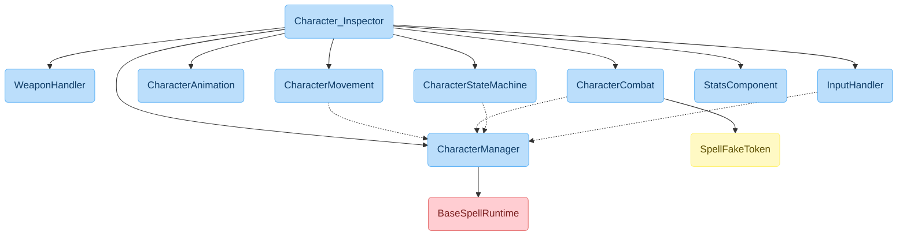
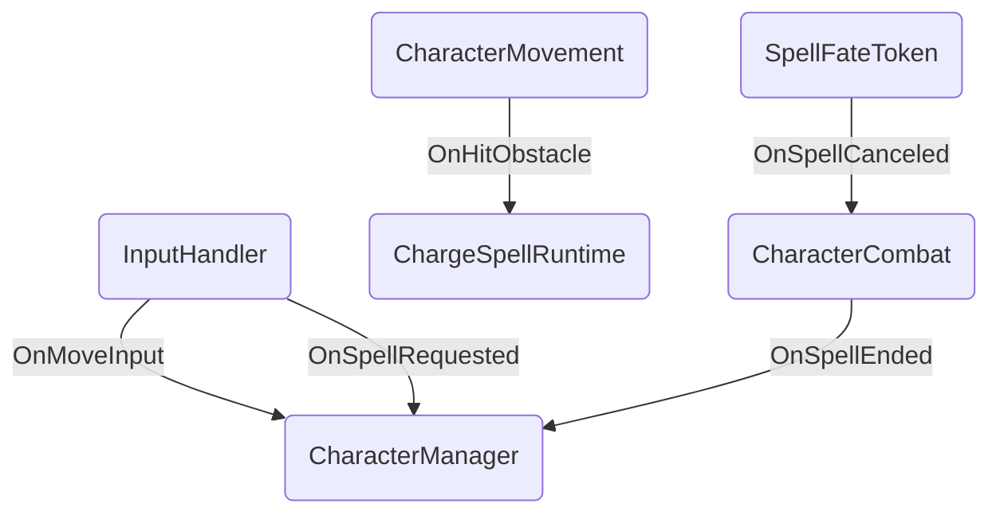

#Object_Interactions

```mermaid
flowchart TD
%% ===== COLOR PALETTE SNIPPET =====
%% Blue
classDef blueLight  fill:#BBDEFB,stroke:#64B5F6,color:#0D3B66
classDef blueMedium fill:#42A5F5,stroke:#1E88E5,color:#fff
classDef blueHigh   fill:#0D47A1,stroke:#0A3577,color:#fff

%% Red
classDef redLight  fill:#FFCDD2,stroke:#E57373,color:#7A1F1F
classDef redMedium fill:#EF5350,stroke:#D32F2F,color:#fff
classDef redHigh   fill:#B71C1C,stroke:#7F1313,color:#fff

%% Green
classDef greenLight  fill:#C8E6C9,stroke:#81C784,color:#1B4D20
classDef greenMedium fill:#66BB6A,stroke:#388E3C,color:#fff
classDef greenHigh   fill:#1B5E20,stroke:#123D15,color:#fff

%% Yellow
classDef yellowLight  fill:#FFF9C4,stroke:#FFF176,color:#5C4E00
classDef yellowMedium fill:#FFEB3B,stroke:#FBC02D,color:#3D3200
classDef yellowHigh   fill:#F9A825,stroke:#C77800,color:#fff
%% ===== END PALETTE SNIPPET =====

%% Character in inspector Objects
A(Character_Inspector)
A --> B(WeaponHandler)
A --> C(CharacterMovement)
A --> D(CharacterAnimation)
A --> E(CharacterCombat)
A --> F(CharacterStateMachine)
A --> G(CharacterManager)
A --> H(InputHandler)
A --> I(StatsComponent)

%% CharacterManager communicate with :
C -.-> G
E -.-> G
F -.-> G
H -.-> G

%% Spell System interaction
G --> AA(BaseSpellRuntime)

%% SpellFateToken
E --> AAA(SpellFakeToken)

class A blueLight
class B blueLight
class C blueLight
class D blueLight
class E blueLight
class F blueLight
class G blueLight
class H blueLight
class I blueLight

class AA redLight

class AAA yellowLight
```

#Events

```mermaid
flowchart TD
A(InputHandler) -- OnMoveInput<Vector2> --> B(CharacterManager)
A(InputHandler) -- OnSpellRequested<Spell_data> --> B(CharacterManager)

C(CharacterMovement) -- OnHitObstacle<Collider> --> D(ChargeSpellRuntime)
E(CharacterCombat) -- OnSpellEnded<Spell_data> --> B

F(SpellFateToken) --  OnSpellCanceled<SpellCancelBy> --> E

```