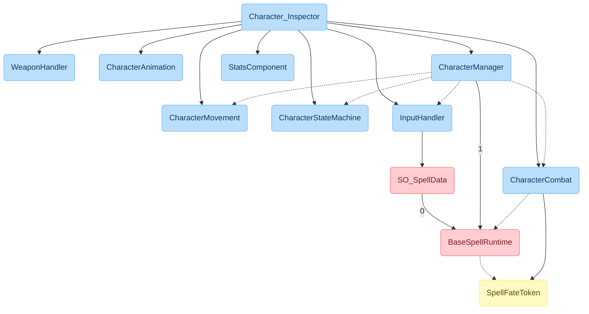
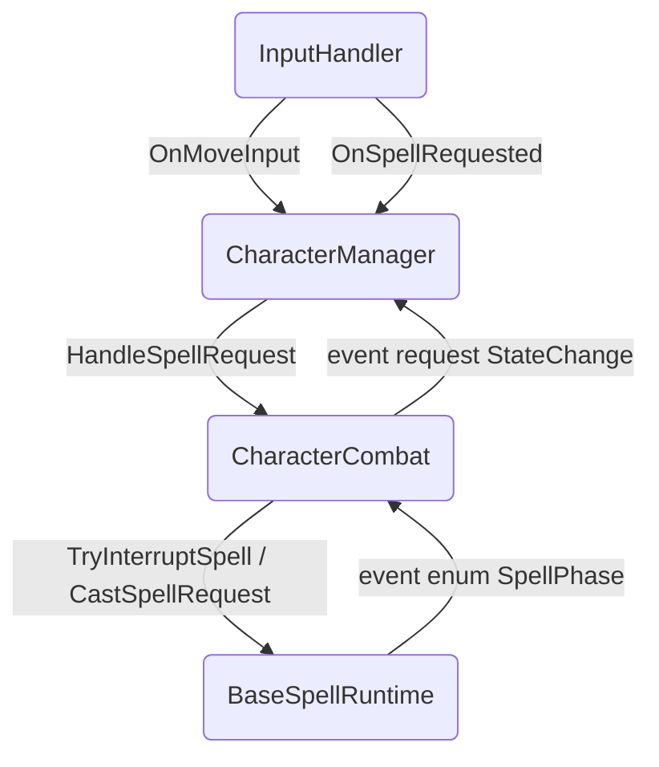
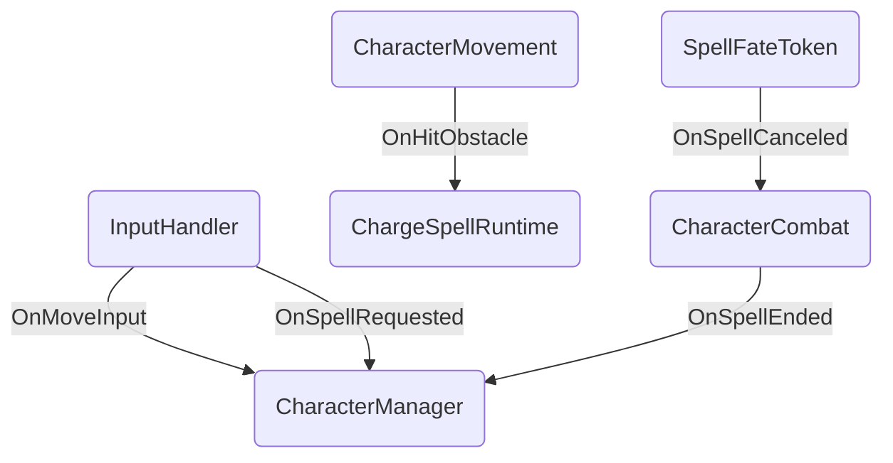

#Object_Interactions

```mermaid
flowchart TD
%% ===== COLOR PALETTE SNIPPET =====
%% Blue
classDef blueLight  fill:#BBDEFB,stroke:#64B5F6,color:#0D3B66
classDef blueMedium fill:#42A5F5,stroke:#1E88E5,color:#fff
classDef blueHigh   fill:#0D47A1,stroke:#0A3577,color:#fff

%% Red
classDef redLight  fill:#FFCDD2,stroke:#E57373,color:#7A1F1F
classDef redMedium fill:#EF5350,stroke:#D32F2F,color:#fff
classDef redHigh   fill:#B71C1C,stroke:#7F1313,color:#fff

%% Green
classDef greenLight  fill:#C8E6C9,stroke:#81C784,color:#1B4D20
classDef greenMedium fill:#66BB6A,stroke:#388E3C,color:#fff
classDef greenHigh   fill:#1B5E20,stroke:#123D15,color:#fff

%% Yellow
classDef yellowLight  fill:#FFF9C4,stroke:#FFF176,color:#5C4E00
classDef yellowMedium fill:#FFEB3B,stroke:#FBC02D,color:#3D3200
classDef yellowHigh   fill:#F9A825,stroke:#C77800,color:#fff
%% ===== END PALETTE SNIPPET =====
%% ===== START VAR SNIPPET ====
SpellRunTime(BaseSpellRuntime)
SpellFateToken(SpellFateToken)
SO_SpellData(SO_SpellData)

%% ===== END VAR SNIPPET ====

%% Objects creation hierarchy 
CharacterInspector(Character_Inspector)
CharacterInspector --> WeaponHandler(WeaponHandler)
CharacterInspector --> CharacterMovement(CharacterMovement)
CharacterInspector --> CharacterAnimation(CharacterAnimation)
CharacterInspector --> CharacterCombat(CharacterCombat)
CharacterInspector --> CharacterStateMachine(CharacterStateMachine)
CharacterInspector --> CharacterStateManager(CharacterManager)
CharacterInspector --> InputHandler(InputHandler)
CharacterInspector --> StatsComponent(StatsComponent)

%% References to :
CharacterStateManager -.-> CharacterMovement
CharacterStateManager-.-> CharacterCombat
CharacterStateManager -.-> CharacterStateMachine
CharacterStateManager -.-> InputHandler
SpellRunTime -.-> SpellFateToken

%% Spell System interaction
InputHandler --> SO_SpellData
SO_SpellData -- 0 --> SpellRunTime
CharacterStateManager -- 1 --> SpellRunTime
CharacterCombat -.-> SpellRunTime

%% SpellFateToken
CharacterCombat --> SpellFateToken

class CharacterInspector blueLight
class WeaponHandler blueLight
class CharacterMovement blueLight
class CharacterAnimation blueLight
class CharacterCombat blueLight
class CharacterStateMachine blueLight
class CharacterStateManager blueLight
class InputHandler blueLight
class StatsComponent blueLight

class SpellRunTime redLight
class SO_SpellData redLight

class SpellFateToken yellowLight
```

#Combat Logic

```mermaid
flowchart TD
InputHandler(InputHandler) -- OnMoveInput<Vector2> --> CharacterManager(CharacterManager)
InputHandler(InputHandler) -- OnSpellRequested<Spell_data> --> CharacterManager(CharacterManager)
CharacterManager -- HandleSpellRequest --> CharacterCombat(CharacterCombat)
CharacterCombat -- TryInterruptSpell / CastSpellRequest --> BaseSpellRuntime(BaseSpellRuntime) 
BaseSpellRuntime -- event enum SpellPhase --> CharacterCombat
CharacterCombat -- event request StateChange --> CharacterManager
```
#Events

```mermaid
flowchart TD
CharacterInspector(InputHandler) -- OnMoveInput<Vector2> --> WeaponHandler(CharacterManager)
CharacterInspector(InputHandler) -- OnSpellRequested<Spell_data> --> WeaponHandler(CharacterManager)

CharacterMovement(CharacterMovement) -- OnHitObstacle<Collider> --> CharacterAnimation(ChargeSpellRuntime)
CharacterCombat(CharacterCombat) -- OnSpellEnded<Spell_data> --> WeaponHandler

CharacterStateMachine(SpellFateToken) --  OnSpellCanceled<SpellCancelBy> --> CharacterCombat
```