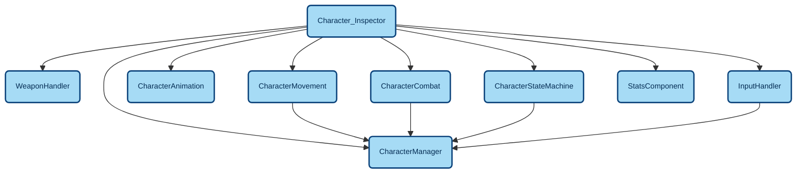

# ToDo
put the shield on the hand while charging // make a system for each spells has a way to handle weapon
-> spellData has the information about the weapon -> SpellRuntime use it to communicate with the WeaponHandler class
How spellData define the information ? LH (Left Hand) RH (Right hand) BH (Both hand) TH (Two_Hand) and then which kind of weapon (BOW ? TWO_HANDERS ? 1H_SWORD ? 2H_Arbalest ? 1H_SHIELD ?)
How to create a nice hierarchy of class and objects. Class are just patron to objects so maybe I just should track the object and reference to other objects
Use Layer to make hierarchy
Layer Event Object trigger event ? Which ? Where 
Layer Objects how they interact and keep reference of each other

# Game Monolith
## GameManager
## Character
functions split in multiple class:
 -CharacterMovement that handle the character movement
-CharacterAnimation that handle the character animation
-CharacterCombat that handle the character combat
*OnSpeedEnded
-CharacterStateMachine that handle the state transition of the character
-CharacterManager where character road cross, receive event from input, statemachine and characterCombat to change character behaviour (moving, casting,...) 
-WeaponHandler a class that instantiate weapon on the right slot on the character  
## Input
-InputHandler handle the input and keybinds associated with spells and send change to the characterManager and prob UIManager next...
*OnMoveInput, *OnSpellRequested
## Spell Error token
-SpellFateToken is a class that can create a token object linked to a spell and if the token is cancelled to spell is stopped (BaseSpellRuntime) and trigger an event
*OnSpellCancelled

track the event with *
Create a spell Manager that can easily provide spell to the character
8/7/26
## Spells architecture
main class (abstract) is BaseSpellRuntime that has a constructor
the class has a main coroutine method to run spell : StartSpell 
This method will run Start, Loop and End coroutine
the spell specificities is defined in Spell_data (SO) and his childs like ChargedSpell_data
the Spell_data has a method to create the BaseSpellRuntime GameObject
the BaseSpellRuntime implement an interface that :
-demand validation (caster exists, animator present,...) through validate method
-demand StartSpell implementation
-has method that is called when spell is finished

## others
:only : remove all other windows with all scripts in it
space + b + o : remove all other scripts
search and replace in vscode ^(\s*)(.*Debug\.Log.*)$ -> 
* next word under cursor # backward direction
Search file in explorer : ctrl + p
Search for text insides files : ctrl + shift + p
Toggle Maximize Editor Group : shit alt m
Command Palette : Ctrl + shift + p
7/7/26
Animation end trop lente de la charge

## git
before pulling if I made change already
git stash
git pull origin main
git stash pop  

## Mermaid
Install Mermaid support tool on VScode
ctrl + shift + v to see preview mode

#Object_Interactions


#Events
```mermaid


```