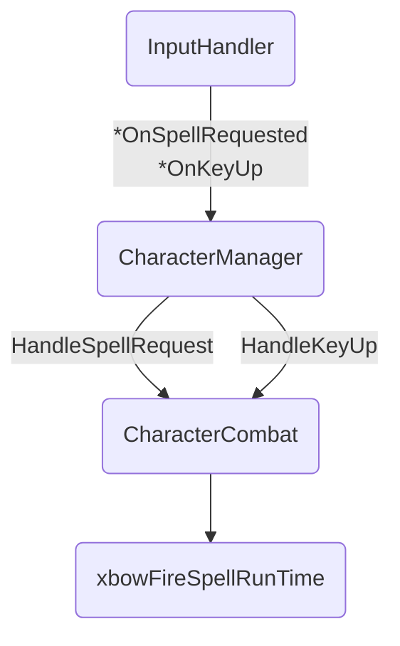

```mermaid
flowchart TD
xbowFireSpellRuntime(xbowFireSpellRunTime)
InputHandler(InputHandler)
CharacterCombat(CharacterCombat)
CharacterManager(CharacterManager)

InputHandler -- *OnSpellRequested \n *OnKeyUp --> CharacterManager
CharacterManager -- HandleSpellRequest --> CharacterCombat 
CharacterManager -- HandleKeyUp --> CharacterCombat 
CharacterCombat -->xbowFireSpellRuntime
```